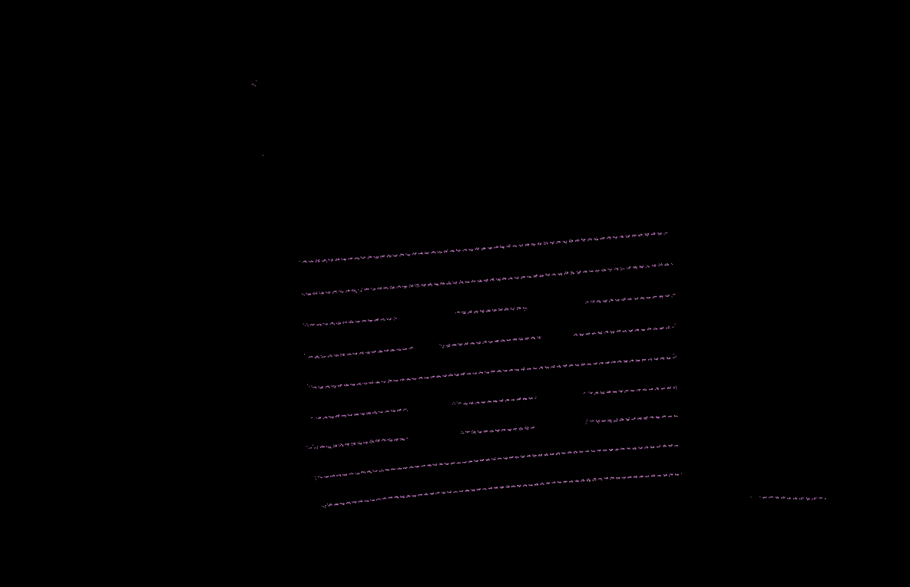
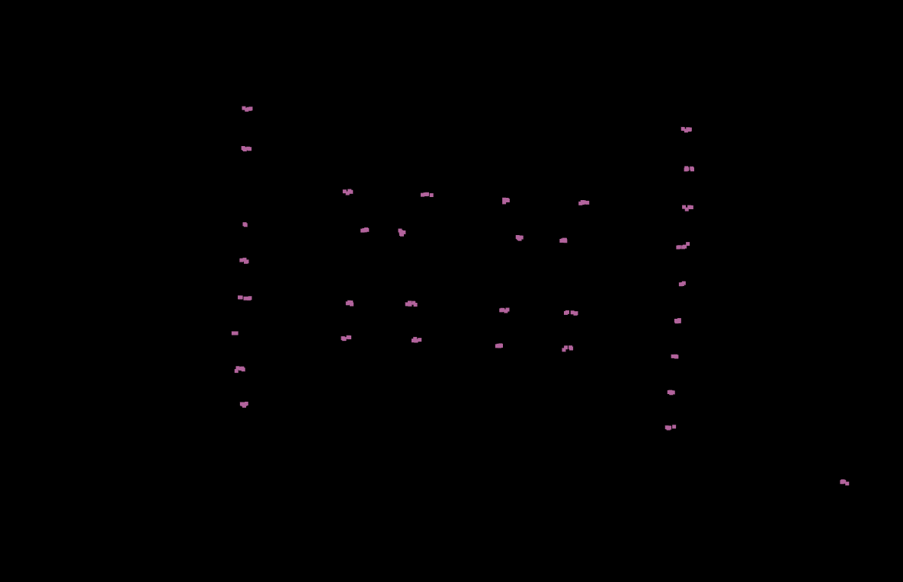
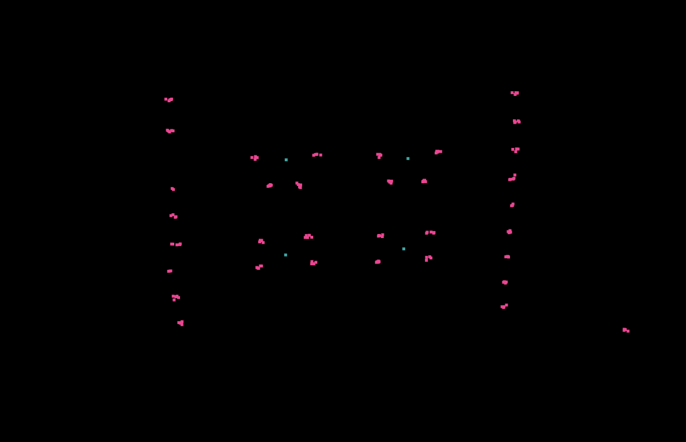

# FAST-Calib_wo_ros_mech_solid
This is a FAST-Calib implementation without ros1 with added contribution for mechanical LiDARs.  The additional contribution from my side is on the mechanical LiDAR support function and implementation. We use NPZ file as data input and use the python script to transfer it as txt with x,y,z,intensity and ring.

    

# Pre - install
Please install the following:-

    sudo apt install -y build-essential gcc g++
    sudo apt install -y libopencv-dev
    sudo apt install -y libpcl-dev
    sudo apt install -y libgflags-dev
    sudo apt install -y libgoogle-glog-dev
    sudo apt install -y libyaml-cpp-dev

# Process to Convert npz to txt

Use the `npz_to_pcd_txt.py` to convert the npz to txt.
Note:- you need to modify the following parameter in the script - 

    input_dir = Path("the folder to *.npz of one photo scene")
    output_dir = Path("the output folder")
Copy this output and paste it in the data folder with the following naming convention:- `image_file_name_pcd`
The data folder should look like this:-

    data
    |-> image.png
    |-> image_pcd
	|   |-> file1.txt
	|	   |-> file2.txt
	|-> camera_intrinsic.yaml

# Process to Build the code
Currently the I have the built code, but if some modification made to struct.hpp where the parameter are available please build and use, else you don't need to build.
**Build and Run**
Clone the Project

    git clone https://github.com/kausikp11/FAST-Calib_wo_ros_mech_solid.git
    cd FAST-Calib_wo_ros_mech_solid

**Build the Project**

    mkdir build && cd build
    cmake ..
    make

# Process to Use the built code
The following is for the code committed by me. If you have made some additional input parameter please use the same.
Note:- you need to give the camera intrinsic as **yaml** not *~~json~~*
**Usage**

    ./my_fast_calib -cam_intrinsic_file /path/to/data/camera_pinhole.yaml --data_dir /path/to/data --output_dir /path/to/output

# Params which can be adjusted
All the params on the struct.hpp
Parameters where change impacted a lot the following are for mechanical lidar only:-

    #define TARGET_NUM_CIRCLES 4 // number of circles
    #define GEOMETRY_TOLERANCE 0.08 // says how much it can deviate from the actual value
    struct Parameters {
    ...
    double marker_size = 0.2; // size of the aruco marker in m
    double delta_width_qr_center = 0.55; // Distance from Aruco's center to the target's center (width)
    double delta_height_qr_center = 0.55; // Distance from Aruco's center to the target's center (heigth)
    double delta_width_circles = 0.5; // Distance from circle center on width direction
    double delta_height_circles = 0.4; // Distance from circle center on height direction
    double circle_radius = 0.12; // Circle radius
    double plane_dist_threshold = 0.05; // distance between one point to another within a plane
One param in the lidar_detect.hpp, in line 444.
 `float tolerance = 0.005; // this parameter says how much the impact of the circle which will be checked. Try and see a sweet spot where this should be. Changes for each lidar.`

# Some common advice

 1. Please look in to the output folder at each run to understand whether the parameter you changed has some influence. Use pcl_veiwer to open single/multiple pcl file at once.

    pcl_veiwer file_name1.pcd file_name2.pcd // this will visualize multiple file with different color in single window.

 2. Inside PCD viewer, press 1 to change color, if the output is not clearly visible. Press + to increase the point thickness. Use mouse for pan,rotate and tilt.
 3. If the `plane_cloud_0.pcd`file doesnt look like the following you need to check if any issues is there in the lidar data.
 
 4. In the `edge_cloud_0.pcd` file, you should see the output as follows.

 5. When you visualise both the `edge_cloud_0.pcd` and `center_cloud_0.pcd`. The output should be as follows. If not adjust the above parameters (Tweak tolerance in lidar_detect.hpp if center is not at the geometric center)

 6. The current lidar_detect.hpp doesnt create the point cloud if 4 center point doesnt fit within the actual dimension, in that case uncomment the line 589 - 604 and comment the line 506 - 587. This will make all the centre point to be plotted in center_cloud_0.pcd
 7. After all the above there is a possibility it might not be able to detect the circle. This might be because you might have given only one *.txt file in pcd folder. I tested it with more and found out that putting 5 *.txt file was giving a good output with circle and center detection.
